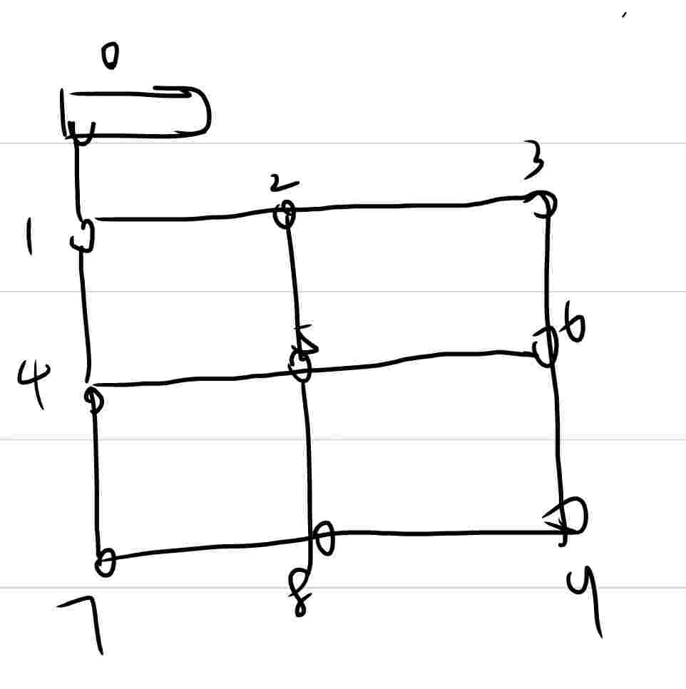
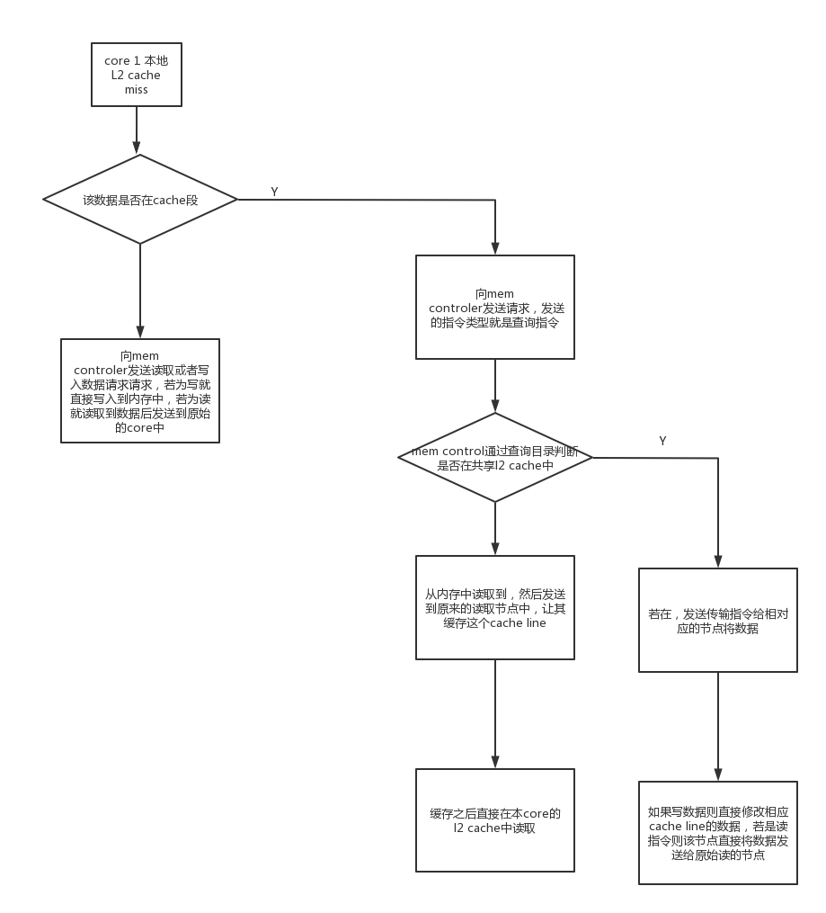

# 整体node的大框架
- 如下图，然后mem controler作为一个node连接在左上角的那个node上
  
- 数据传输上
  - 本身的noc上已经实现了传输起始node id和目标node id
  - 然后noc支持定义传输数量
  - 对于所有node之间通信。主要有三种形式的包类型
    | 传输数据类型 | 传输包类型  | 数据 |  所传输的地址|
    |----|----|----|---|
    |  burst(需要包含burst的长度)| 发送 | | | 
    | normal  | 查询地址 | | |
    |        | 遥控指令(要求节点a向节点b发送数据包) | | |
- 设计的noc中有buffer，并且有优先级判断机制，不需要考虑会不会阻塞
# 详细的L2 cache机制
- 详细的机制如下图

- 需要增加的硬件
  - 每个core L2 cache和noc之间的连接层需要增加一个解码单元，来分辨包的类型、
# mem controler 的组成
- 对外接口
  - yyy后面来定
- 内部组成
  - 一个总的目录，目录采用全相联的结构，然后替换方式采用lru算法，目录里面的配置
    - 目录里面需要包含cache line 的状态信息
    - 在目录里面有cache line的状态信息，并且分开的cache里面也需要，然后直接查询到cache line锁了就直接结束就行
      - 在私有的cache中查询到无法写入就不写入
      - core 私有cache miss 在mem controler中查询到cache锁了就停止 
  - 同样应该有noc节点，并且能够与id为1的核连接
# L2 cache 的组成
- 对外连接noc router的接口中间需要有一个编解码器，来获取或者发送相应的包
- 内部cache的架构就直接一个二路组相联即可，然后cache line里面由state tag 和data组成
- 主要机制和上方图差不多
# 多核方面
- 对于多核处理器系统，情况复杂一些。一般是有一个主核（有时叫core 0）先去完成上述的操作。主核的启动工作完成后，再去唤醒其它的处理器核（可以称为从核）。从核负责初始化私有的TLB和cache等资源，启动之后进入空闲（Idle）状态，直至进入操作系统再由主核进行调度。多核处理器的内核间通信一般会通过信箱（Mailbox）机制或者核间中断机制。信箱机制可以是设计专用的信箱寄存器，主要是为了在内存还没有初始化前就让所有处理器核能够有效通。如果是通过信箱机制，从核在等待唤醒的时候要去定时查询自己的信箱寄存器，如果发现主核唤醒自己，就要从空闲状态出来了。可以看出，信箱寄存器机制需要处理器轮询，所以通信效率不高，在休眠/唤醒这类不频繁的操作中还可以，如果是比较频繁的核间通信就不适用了，要采取中断机制。

- 以上是多核处理器启动的基本原理，至于具体实现，不同的厂商有不同的设计。比如在ARM体系里面，往往会有一个小的系统控制单元（MSCP，Management & System Control Processor）辅助完成简单外设初始化，安全认证等等工作，然后由主核和从核完成剩余的启动工作。
  - 可以弄一个多核控制器