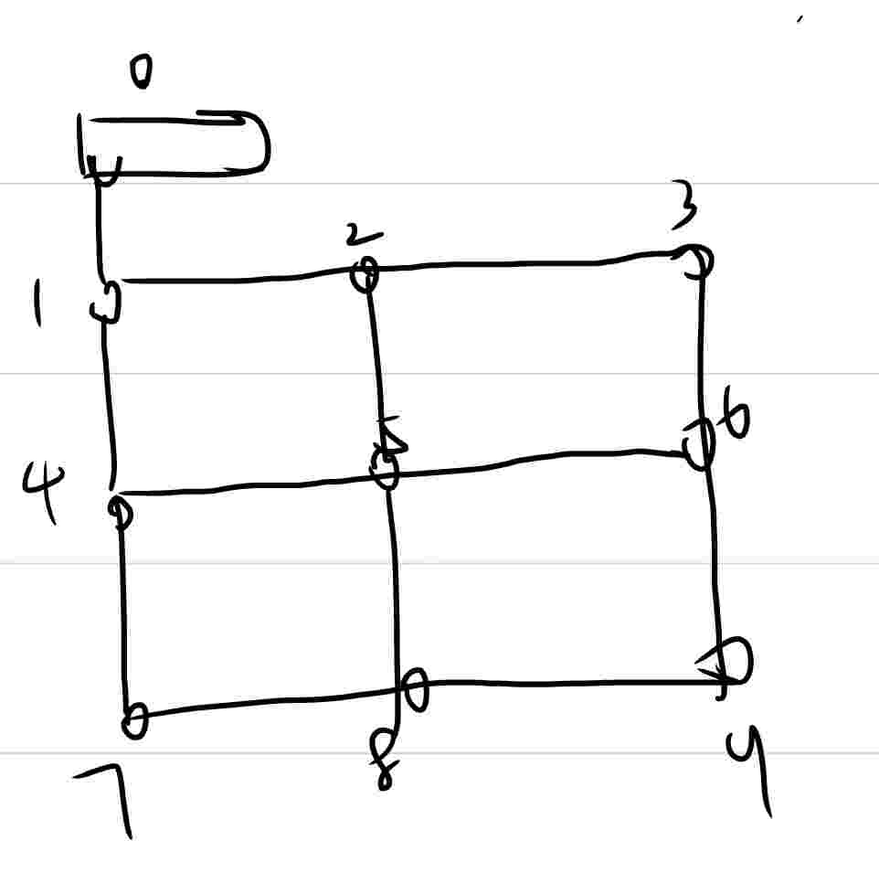
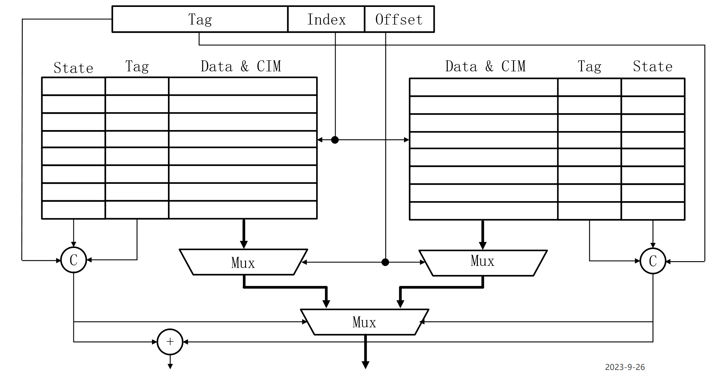
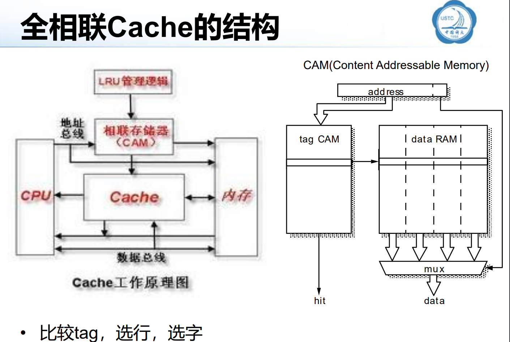
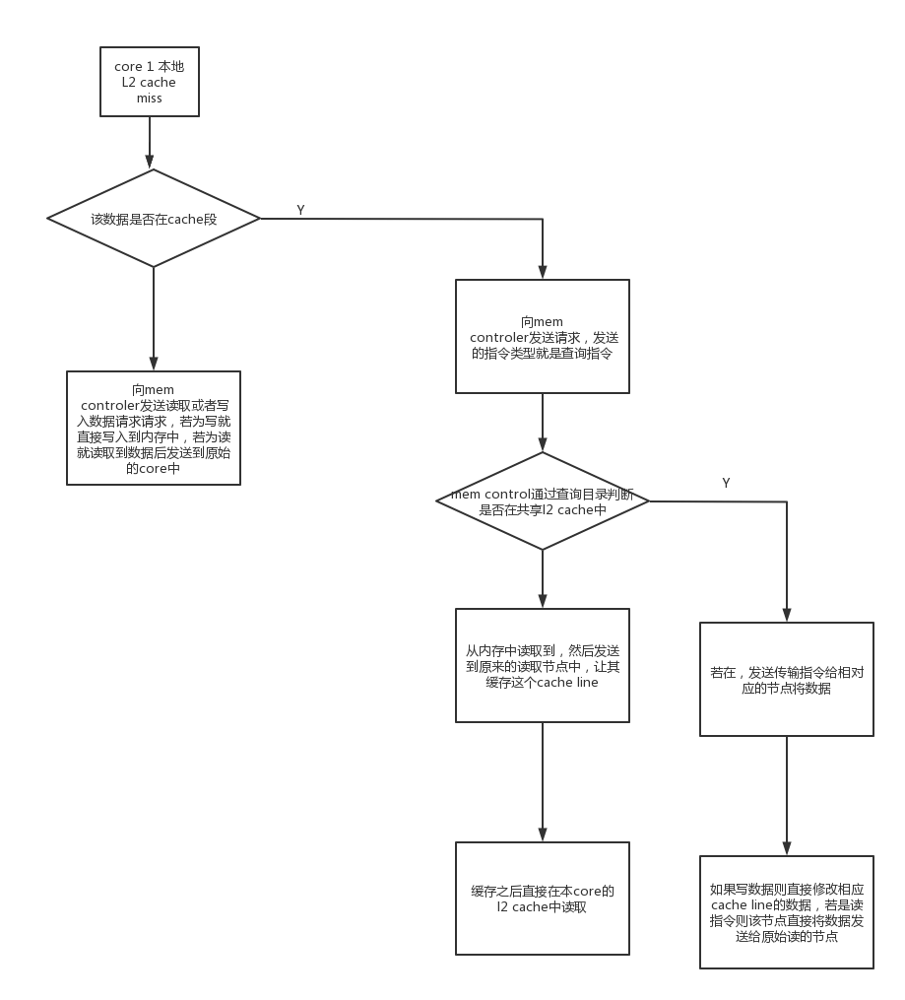
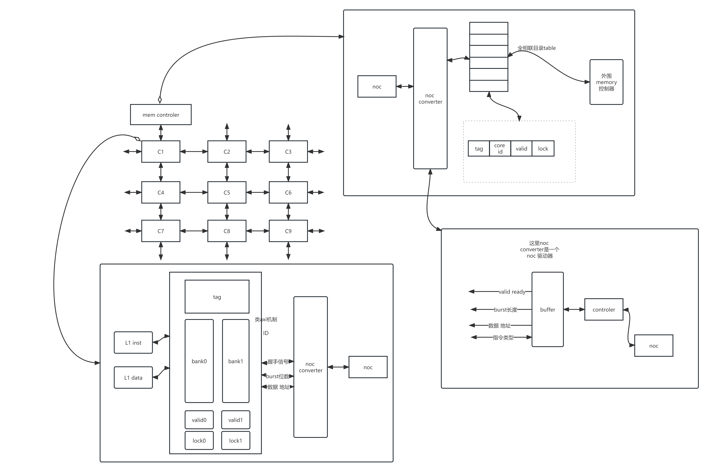

# 以L2 cache为主的芯片架构设计
## 芯片有以下几个模块
  - core(1~9)
    - 共9个核心，每个核心与核心之间通过noc 连接在一起，可以通过主核心来挂载好所有的控制器
     
  - L1 cache
    - 与core相连 
    - 分为inst和data cache
  - L2 cache
    - 内部由二路组相联的结构组成的cache，cache中包含地址的tag 还有addr 和 valid位，还有lock位
  - L2 cache和noc之间的noc converter 单元
  - mem control
    - 内部含有目录
  - noc
## 各模块主要部件及其机制
  - L2 cache
    - tag tag的长度和有效位、lock位还需要商榷   dirty位
    - 两个bank
     
    - 一个总的cache 控制器，状态机和传统的L2cache设计应该差不多，对于该cache来说miss之后都只需要对外发送一个请求数据的指令
    - 对外的接口可以模拟成axi机制
      - id
      - 握手 valid ready
      - burst 位数
      - 数据 地址
      - 特殊的信号
        - unvalid cache line
        - lock or unlock cache line
      - 例如你axi是地址和数据可以同时握手完成传输的，对于miss后的读取操作，地址握手完就不停等待处理就行，不在乎外界是在l2 shared cache里面找到的还是内存里面
  - noc converter (cache端)
    - 接受cache的接口可以模拟成axi机制
        - id
        - 握手 valid ready
        - burst 位数
        - 数据 地址
        - 特殊的信号
          - unvalid cache line
          - lock or unlock cache line
      - 对noc 的接口
        - data
        - valid
        - on off
        - allocatable
      - 目前还没定的是cache line的大小和noc router的每一个flit的传输数据的多少，如果cache line相比于noc router的flit传输数据大小小的话，就不需要弄burst传输了，直接一个flit就能把数据全部传输完
      - 对于noc的驱动，如果需要多个flit才能传完就需要定义协议(
    - 包可以定义成一个带有包类型的包头后面带有数据的类型 感觉难度不大，就节点开始接受数据，屏蔽掉其他的数据就行，或者对于其他的数据只做路由阻塞接受，这个都是需要noc来解决的
  - mem controler
    - 全相联目录
      - 需要存tag valid lock 储存的core id
      - 置换采用fifo算法，相对来说实现起来简单
      - 全相联的cache的数量
        
    - 具体机制
        
  - noc converter (mem controler 端)
    - 接受cache的接口可以模拟成axi机制
        - id
        - 握手 valid ready
        - burst 位数
        - 数据 地址
        - 特殊的信号
          - unvalid cache line
          - lock or unlock cache line
    - 对noc 的接口
        - data
        - valid
        - on off
        - allocatable
    - 总体的框图
       
## 具体的和通信协议有关的东西,
  - 尽量弄成一个flit就可以传输完一次通信的所有数据
  - 定义每次发送的数据都是以cache line为单位
  - 每次的包就包括包类型，数据，地址这几位，取消burst机制
       | 传输包类型  | 数据段 |  地址段|
    |----|----|---|
    |   发送  |具体的数据 | 相对应的地址 |
    |  查询地址 | 空|相对应的地址 |
    |    遥控指令(要求节点a向节点b发送数据包) |目标节点b id | 相对应的地址| 